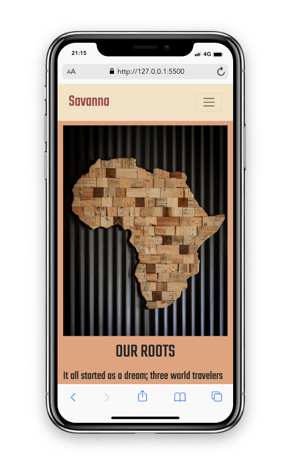
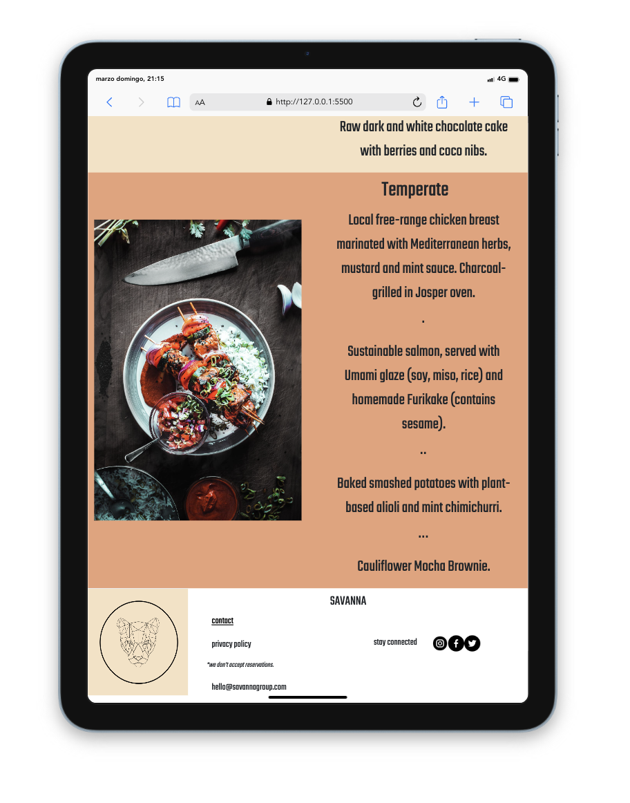
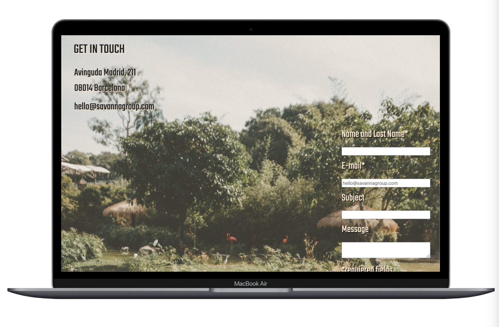

# My first website with HTML and CSS.

## Table of Contents

- [Introduction](#introduction)
- [Requirements & Usage](#requirements)
- [Built with](#builtwith)
- [Demo](#builtwith)
- [Screenshots](#screenshots)

## Introduction 

This is my first website using HTML and CSS. A restaurant website that contains three sentions: Home/Menu/Contact wich name is Savanna. That's under the 'bootcamp'training of the Geekshubs Academy.

## Requirements

The only requirement is to have a code editor like "Visual Studio Code" for example.

### Demo & screenshoots

To preview the demo <a href="https://leyreromero.github.io/restaurant-ok/" > tap here </a>.

 
